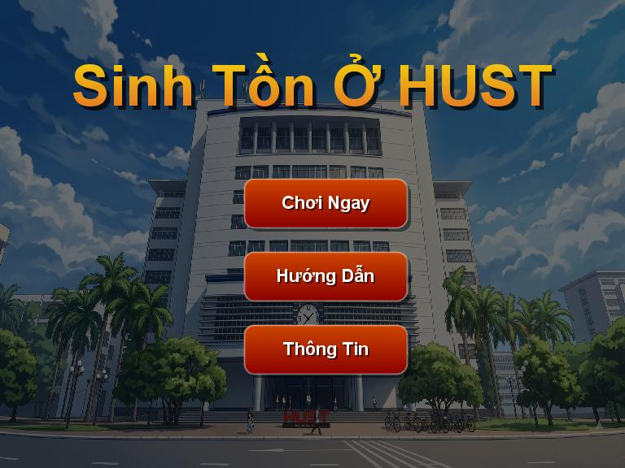
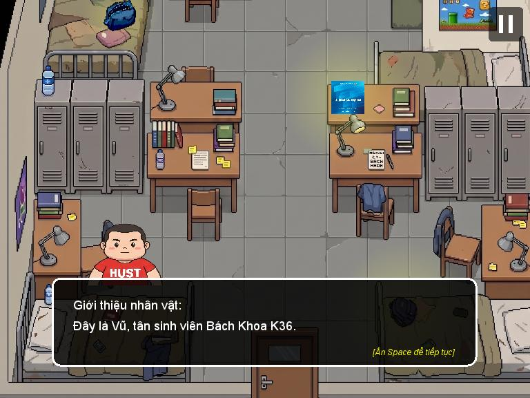
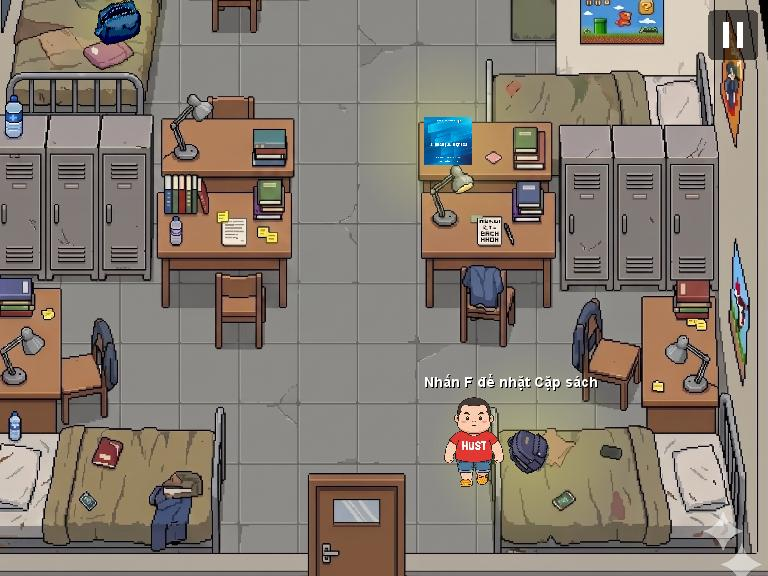
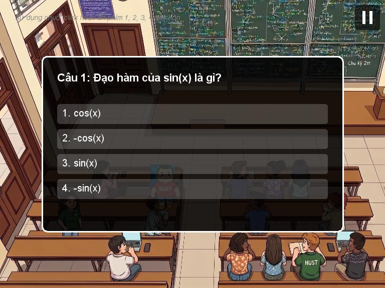
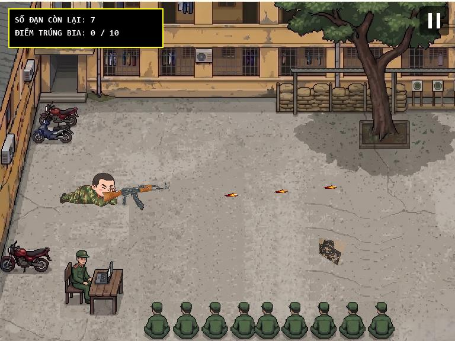
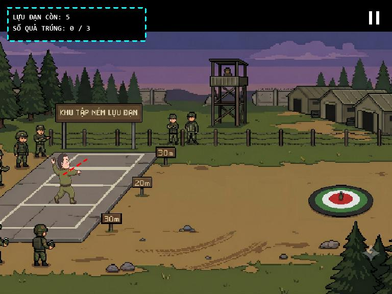
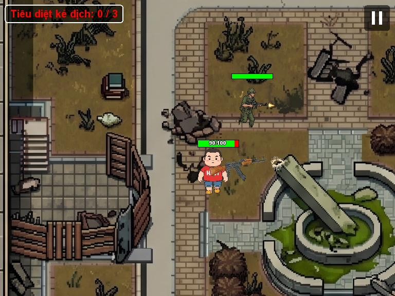

<div align="center">


### A story-driven 2D action game about surviving university, built from scratch in Java

*Dodge expulsion, pass Calculus, survive military training, and fight your way onto the memorial wall.*


-blue)


[Screenshots](#-screenshots) · [Gameplay](#-gameplay) · [Run it](#-run-it) · [Under the hood](#-under-the-hood) · [Project structure](#-project-structure)

</div>

---

## About

**Sinh Tồn Ở HUST** ("*Surviving at HUST*") follows **Vũ**, a fresh first-year student at Hanoi University of Science and Technology (HUST, *Bách Khoa*). He just wants to graduate on time and become a great engineer. Instead he gets an oversleeping accident, a Calculus exam that can get him expelled, two brutal military-training finals, and a very real war.

The game starts as a comedy full of student-life memes and ends as a sincere tribute to the nearly 3,000 HUST students and staff who set down their books and went to the front in 1971–72.

It is a complete, playable game with a menu, cutscenes, quizzes, three different mini-game mechanics, a top-down combat level with enemy AI, and multiple fail/retry paths, all written in plain Java on the standard library. No game engine, no frameworks, no external dependencies.

> The in-game text is in Vietnamese. This README explains everything you need to follow along.

## 📸 Screenshots

<table>
  <tr>
    <td align="center"><br><sub><b>Main menu</b></sub></td>
    <td align="center"><br><sub><b>Dorm: story intro with typewriter dialogue</b></sub></td>
  </tr>
  <tr>
    <td align="center"><br><sub><b>Dorm: grab your backpack, book and pencil case</b></sub></td>
    <td align="center"><br><sub><b>Classroom: the Calculus quiz that decides your fate</b></sub></td>
  </tr>
  <tr>
    <td align="center"><br><sub><b>Military training: shooting range with a moving target</b></sub></td>
    <td align="center"><br><sub><b>Military training: slingshot-style grenade throw</b></sub></td>
  </tr>
  <tr>
    <td colspan="2" align="center"><br><sub><b>Final battle: top-down combat against AI soldiers</b></sub></td>
  </tr>
</table>

## 🎮 Gameplay

Each stage is its own game state with its own rules, so the game keeps changing what it asks of you.

| # | Stage | What you do | Win / lose |
|---|-------|-------------|------------|
| 1 | **Dormitory** | Wake up to a prank call, explore the room and pick up your **backpack, Calculus book and pencil case** with `F`, then head for the door. | Can't leave without all three items. |
| 2 | **Lecture hall** | Walk to the front-row desk and take a **5-question Calculus quiz** (derivatives, integrals, limits, series). | Score **3/5 or more** to pass. Fail and you're expelled (cutscene), then retry. |
| 3 | **Parabol Gate** | Arrive at the military-training campus. | Reach the gate and press `F` to continue. |
| 4 | **Shooting range** | Fire an AK at a **decoy target that randomly changes direction**. You only get **10 bullets**. | Hit **8 or more**. The stage fails early once 8 hits become impossible. |
| 5 | **Grenade range** | **Drag and release the mouse** to aim a grenade with physics: gravity, bounce and friction. **5 grenades.** | Land **3 or more** in the target zone. |
| 6 | **March to the front** | Animated cutscene with narration. | n/a |
| 7 | **Final battle** | Top-down combat on a ruined campus. Enemies chase, strafe, dodge your bullets and shoot back. Use your **kick** and **grenade** skills to survive. | Defeat all **3 soldiers** before your health hits 0. |
| 8 | **Ending** | A tribute to the HUST students of 1971–72, then back to the menu. | n/a |

Fail states loop back into retries (or a **Game Over** screen with *Retry / Menu*), and a **pause menu** with in-game help is available in every stage.

### Controls

| Input | Action |
|-------|--------|
| `W A S D` or arrow keys | Move (diagonal speed is normalised) |
| Mouse | Aim. Hold the left button to fire in the final battle, click to fire on the range |
| Mouse drag and release | Aim and throw grenades in the grenade range |
| `K` | **Kick**: knocks back nearby enemies (2 s cooldown) |
| `G` | **Grenade skill**: lobs a grenade at the nearest enemy, 200 area damage (5 s cooldown) |
| `F` | Interact / pick up items |
| `Space` | Advance dialogue |
| `1` `2` `3` `4` | Answer quiz questions |
| `P` | Skip to the next stage (handy for testing) |
| Pause button (top right) | Pause menu with resume, help and quit to menu |

## 🚀 Run it

**Requirements:** a JDK (developed and tested on JDK 25). There is nothing else to install.

```bash
git clone https://github.com/hung-nguyenduc/java-2d-game.git
cd java-2d-game
```

**Windows (PowerShell)**

```powershell
javac -encoding UTF-8 -d out (Get-ChildItem -Recurse src -Filter *.java).FullName
java -cp "out;res" main.Main
```

**macOS / Linux**

```bash
javac -encoding UTF-8 -d out $(find src -name "*.java")
java -cp "out:res" main.Main
```

> `res/` must be on the classpath. Sprites, maps and GIFs are loaded with `getResourceAsStream`.

**From an IDE:** open the folder in IntelliJ IDEA, Eclipse or VS Code and mark both `src` (sources) and `res` (resources) as source folders (the Eclipse `.classpath` already does this), then run `main.Main`.

## 🛠 Under the hood

The most interesting engineering in the project, for anyone reading the code.

**Game loop and rendering** (`main/GamePanel.java`)
- Fixed **60 FPS loop** driven by `System.nanoTime()`. It sleeps only for the remaining frame time, so there is no busy-waiting and no drift. After a long stall (GC pause, OS hiccup) it resyncs instead of running a burst of catch-up frames.
- `update()` and `paint` run in lock-step (`invokeAndWait` + `paintImmediately`), which removes the race between the game thread and Swing's Event Dispatch Thread. A Windows timer-resolution workaround keeps `Thread.sleep` accurate to ~1 ms.
- **Resolution-independent rendering:** everything draws to a virtual **768×576** canvas (16×12 tiles of 48 px) that is scaled and letterboxed to any window size, with inverse mapping so mouse input stays accurate when the window is resized.
- **Scrolling camera** clamped to map bounds. Maps are pre-scaled once into hardware-compatible images (`createCompatibleImage`) so per-frame drawing is a cheap blit.

**State machine** (`state/`)
- An abstract `GameState` (`enter / exit / update / draw / handleMouseClick`) with **15 concrete states**: menus, cutscenes, dialogue-driven levels, mini-games, combat and endings.
- `GamePanel.setState()` initialises the new state *before* swapping it in, so the render thread never sees half-built data.

**Gameplay systems** (`entity/`, `collision/`, `dialogue/`)
- **Enemy AI** is built from simple steering behaviours: pursue when far, **circle-strafe** when close, **sidestep incoming bullets** by moving perpendicular to their trajectory, and **separate from each other** with a repulsion force so they don't stack. Animated with 6 directions × 4 frames.
- **Weapons:** the gun sprite rotates around a grip pivot with `AffineTransform`, flips when aiming left, and computes the muzzle position from the aim angle for accurate bullet spawn and muzzle flash. Supports semi-auto and full-auto fire, and spread-shot.
- **Physics:** bouncing grenades (gravity, restitution, friction) for the range, and a **parabolic-arc area-of-effect grenade** with cooldown for the combat skill.
- **Data-driven collision:** obstacle rectangles live in plain `.txt` files (`res/maps/*.txt`), are scaled to match each map at load time, and are resolved with AABB checks for the player, player bullets and enemy bullets. Level designers can edit collision without touching code.
- **Dialogue system:** typewriter text, character avatars, skip-to-complete, and completion callbacks that drive level progression.
- **Thread-safety details:** `CopyOnWriteArrayList` for projectiles, `volatile` input flags, and a global `KeyEventDispatcher` so input works regardless of focus.

**Tooling** (`tools/`)
- `SpriteCutter` and `SpriteFixer` are small utilities that slice a sprite sheet into individual animation frames and re-centre each one on a uniform canvas.

**By the numbers:** about 5,500 lines of Java across 35 files · 15 game states · 120+ art and media assets · 300+ commits from 5 contributors, using feature branches (`feature/collision`, `feature/shooting`, `feature/enemy-animation`, …). See the [contributors graph](https://github.com/hung-nguyenduc/java-2d-game/graphs/contributors).

## 📁 Project structure

```
java-2d-game/
├── src/
│   ├── main/         # Entry point, game loop (GamePanel), keyboard & mouse input
│   ├── state/        # GameState base class + every level, cutscene and menu
│   ├── entity/       # Player, Enemy, Weapon, Bullet, Grenade, SkillGrenade, Item
│   ├── collision/    # CollisionChecker, Obstacle, file-based ObstacleManager
│   ├── dialogue/     # DialogueManager (typewriter effect) and DialogueLine
│   └── tools/        # Sprite-sheet cutting and cleanup utilities
├── res/              # Sprites, maps + obstacle files, NPCs, GIF cutscenes, UI
└── docs/             # Original idea, storyline and planning notes, screenshots
```

## 🗺 Ideas for what's next

- Sound effects and background music (the code already has placeholders for it)
- Laser projectiles with dynamic lighting on muzzle flash
- More stages from the original storyline in [`docs/storyline.md`](docs/storyline.md): harder enemy waves, invisible fast enemies, and a graduation ending
- Save / checkpoint system

---

<div align="center">

*Built with Java and a healthy fear of Calculus.*

</div>
