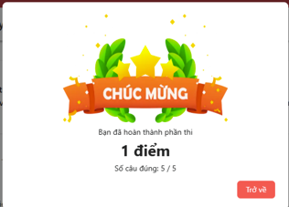
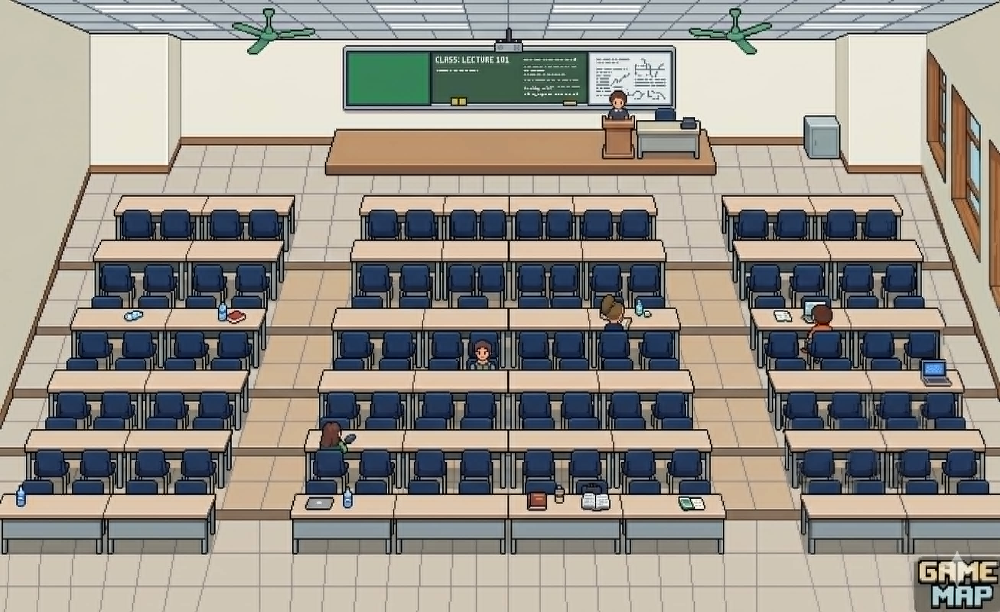

Project xây dựng một trò chơi mô phỏng môi trường học tập tại HUST. Người chơi sẽ nhập vai một sinh viên và khám phá khuôn viên trường thông qua bản đồ 2D, tương tác với các nhân vật (NPC) như giảng viên, bạn bè và nhân viên trong trường.

Người chơi sẽ thực hiện các nhiệm vụ khác nhau như tham gia lớp học, hoàn thành bài tập, vượt qua các kỳ thi và giải quyết các thử thách trong quá trình học tập. Thông qua việc hoàn thành các nhiệm vụ và tích lũy điểm rèn luyện, nhân vật sẽ nâng cấp kỹ năng và tiến dần đến mục tiêu cuối cùng là hoàn thành chương trình học và tốt nghiệp.

Sản phẩm được phát triển bằng ngôn ngữ Java, áp dụng các nguyên lý lập trình hướng đối tượng (OOP) như đóng gói, kế thừa và đa hình để xây dựng các thành phần của trò chơi như nhân vật, bản đồ, hệ thống nhiệm vụ và tương tác giữa các đối tượng.

Giới thiệu nhân vật: Đây là vũ, vũ là một tân sinh viên Bách Khoa K36, tự tin bước vào trường với ước mơ ra trường đúng hạn và trở thành một kỹ sư tài ba. 

Năm 1: học giải tích 3
    Nội dung: làm 5 câu fami sohoa
    - Nếu đỗ --> qua năm 2
    
    - Nếu trượt --> chưa tày --> đuổi học

Vào game --> Nhận nhiệm vụ phải đi học giải tích --> Meme Độ mixi: alo vũ à vũ, ôi em ơi, số điện thoại, địa chỉ nhà anh đều có ở đây hết rồi, em đừng có chối
Thế em có định đi học giải tích ko?>
.. ôi thôi chết quên mẹ giờ học, phải đi ngay thôi

Đến giảng đường, Vũ với quyết tâm A+ giải tích nên đã lên thẳng bàn đầu ngồi. 

Ngồi vào bản --> làm 3 câu fami sohoa

Năm 2: Đại dịch zombie, cầm súng lên đường
    - Nếu sống --> năm 3   
    - Nếu chết --> sayonara
Năm 3: Người ngoài hành tinh xâm lược trái đất
    - Nếu sống --> năm 4
    - Nếu chết --> sayonara (nghĩ kết khác năm 2)
Năm 4: ...
    - Nếu qua --> tốt nghiệp xs, lương triệu đô
    - Không qua --> bằng khá, đi chạy grab