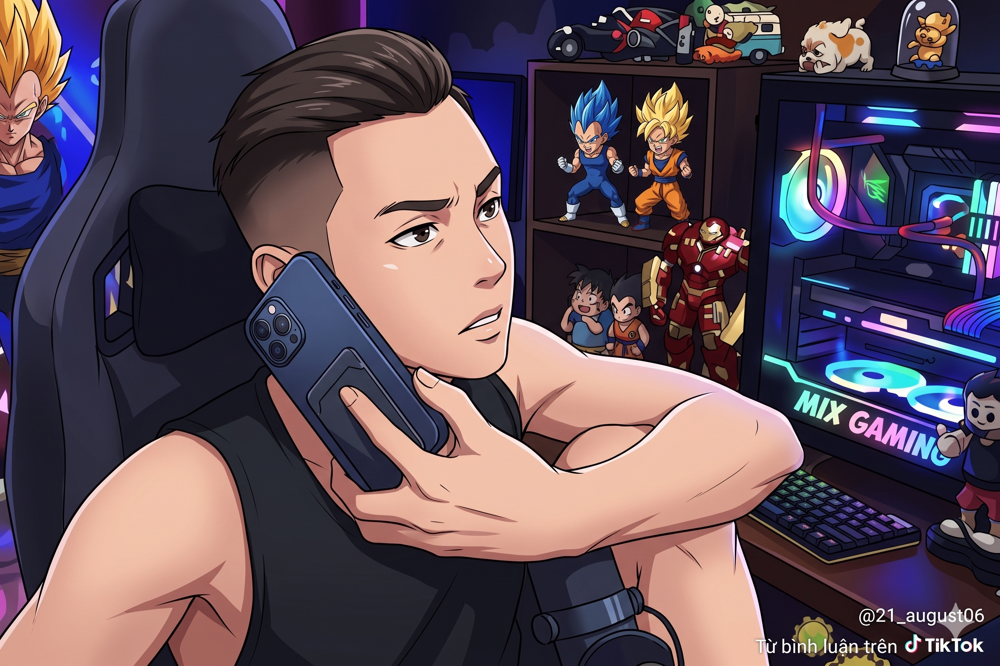

Giới thiệu nhân vật (nền cổng parabol bk, có hội thoại giới thiệu nhân vật): Đây là Vũ, Vũ là một tân sinh viên Bách Khoa K36, tự tin bước vào trường với ước mơ ra trường đúng hạn và trở thành một kỹ sư tài ba.

------Map1: KTX-------
(Chuyển cảnh)
Năm 1: học giải tích 3
Bối cảnh: kí túc xá, Vũ đang ngủ, ngáy khò khò, bỗng nhiên chuông điện thoại reo, Vũ nhấc máy lên. 

Độ mimi: Alo Vũ à Vũ? Ôi em ơi, số điện thoại, địa chỉ nhà anh đều có ở đây hết rồi, em đừng có chối
Vũ: Ơ anh nhầm người rồi...
Độ Mimi: Thế em có định đi học giải tích ko?
Vũ: Ôi thôi chết quên mẹ giờ học rồi, phải đi ngay thôi

Tương tác với object: Lấy sách vở, ba lô, bánh mì, nếu không lấy đủ đồ --> không đủ thì không cho ra khỏi phòng.

(Chuyển cảnh: animation Vũ chạy sml đi học, miệng ngậm bánh mì, tay xách ba lô)

-----Map2: Giảng đường------

Đến giảng đường, Vũ với quyết tâm A+ giải tích nên đã lên thẳng bàn đầu ngồi.
Vừa ngồi vào bản, Vũ đã phải chạm trán thử thách đầu tiên: làm 3 câu fami sohoa

- Nếu đỗ --> qua năm 2

- Nếu trượt --> chưa tày --> đuổi học. Chuyển cảnh: Vũ bị bảo vệ trường bế ra khỏi cổng Parabol. Vũ quyết định về quê nuôi cá và trồng thêm rau.
- 

------Map3: ----------

-------Map 4: Đánh quái P1------
(Chuyển cảnh UFO xâm chiếm trái đất)
Người ngoài hành tinh đổ bộ xâm lược trái đất, Vũ phải gác lại ước mơ học hành để cầm súng lên đường chiến đấu với quái vật.
- Nếu sống --> năm 3   
- Nếu chết --> sayonara (chuyển cảnh ending đài tưởng niệm bk: 10 năm sau, ở đài tưởng niệm bk, có một tấm bia ghi tên những sinh viên đã hy sinh trong cuộc chiến chống lại người ngoài hành tinh, Vũ là một trong số đó)

--------Map 5: Đánh quái P2------
Tăng độ khó: di chuyển né đạn

--------Map 6: Đánh quái P3------
Tăng độ khó: quái tàng hình, di chuyển nhanh

